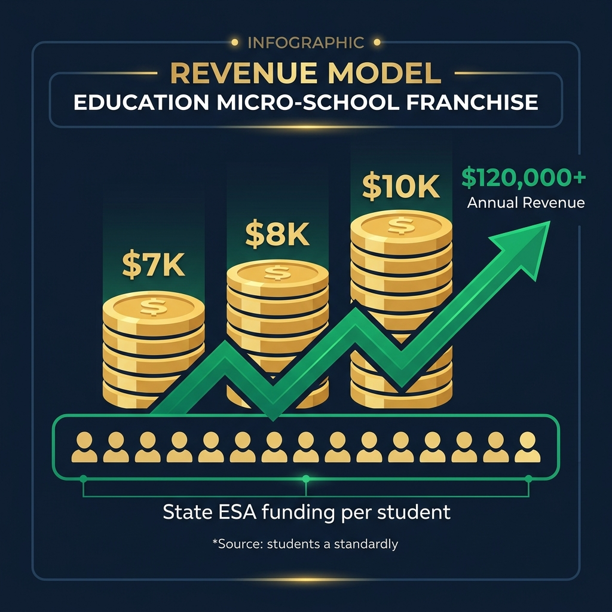

# University School AI — Franchise Opportunity

---

---

# Own the Future of Education.
## Open a University School AI Micro-School — and the Government Will Help Pay For It.

University School AI is an AI-powered learning platform that transforms real university courses into interactive RPG adventures. Students don't just watch lectures — they *play* through history, science, and literature as branching-choice missions where every decision teaches.

We're looking for franchise operators who want to open micro-schools in their communities. Here's the part most people don't know: **in 18 states, the government will pay parents $5,000 – $10,800 per student per year** to send their kids to schools like ours.

That means your students come with built-in revenue. From day one.

---

## The Opportunity in 30 Seconds

- **You open a small learning space** (8-20 students)
- **Parents enroll their kids** — the state pays you $5K-$10.8K per student per year through Education Savings Accounts
- **Your students learn through AI-powered RPG missions** built from real university courses
- **You manage it all** from a franchise dashboard with learning analytics, revenue tracking, and AI-assisted operations
- **Startup costs are covered** by federal Charter School Program grants ($150K-$500K)

> **Bottom line: In the right state, a franchise operator can be cash-flow positive from Month 1 with just 8 students.**

---

## How Parents Get Paid to Choose You

Eighteen states now operate **Education Savings Accounts (ESAs)** — programs where the state deposits money directly into a parent's education account. Parents use those funds to pay for the school of their choice. Including yours.

### What States Pay Parents Per Student, Per Year

| State | Program | Amount/Student/Year | Universal? |
|-------|---------|:-------------------:|:----------:|
| **Texas** | Education Savings Account | **$10,800** | ✅ Yes (2026) |
| **Florida** | Personalized Education Program (PEP) | **$8,000** | ✅ Yes |
| **Utah** | Utah Fits All Scholarship | **$8,000** | ✅ Yes |
| **Arizona** | Empowerment Scholarship (ESA) | **$7,200 – $8,000** | ✅ Yes |
| **Iowa** | Students First ESA | **$7,700 – $7,800** | ✅ Yes |
| **Alabama** | CHOOSE Act | **$7,000** | ✅ Yes |
| **Tennessee** | Education Freedom Act | **$7,000** | ✅ Yes |
| **Arkansas** | Education Freedom Accounts | **$6,600 – $7,000** | ✅ Yes |
| **Wyoming** | Steamboat Legacy Scholarship | **$6,000** | ✅ Yes |
| **South Carolina** | ESA Program | **$6,000 – $7,600** | ✅ Yes |
| **North Carolina** | Opportunity Scholarship | **$3,200 – $7,400** | ✅ Yes |
| **New Hampshire** | Education Freedom Accounts | **$5,200** | ✅ Yes |
| **Louisiana** | LA GATOR Scholarship | **$5,200 – $15,200** | ✅ Yes |
| **West Virginia** | Hope Scholarship | **$4,600 – $4,900** | ✅ Yes |
| **Indiana** | Choice Scholarships | **$6,500** | Broad |
| **Colorado** | Choice Programs | Varies | Partial |
| **Georgia** | Special Needs Scholarship | Varies | Targeted |
| **California** | (No ESA — see charter grants) | N/A | N/A |

> **This is real money.** In Texas, a parent of 2 kids gets **$21,600/year** deposited into their education account by the state. They can use it to pay for your University School AI micro-school.

### What ESA Funds Cover (What Parents Can Spend On)

Parents can use their ESA funds to pay for:
- ✅ **Tuition at your micro-school** (your primary revenue)
- ✅ Curriculum and instructional materials
- ✅ Technology and devices (laptops/tablets)
- ✅ Private tutoring and supplemental instruction
- ✅ Educational therapy and assessments
- ✅ Extracurricular academic programs

**University School AI's $29/month student seat** ($348/year) is a fraction of what the state provides — meaning parents have plenty of ESA funds left over for devices, materials, and your facility fees.

---

## The Math: Your Franchise Revenue

### Scenario: 15-Student Micro-School in an ESA State

| Revenue Source | Per Student | Annual (15 students) |
|---------------|:----------:|:--------------------:|
| State ESA per-pupil funding (avg) | $7,500 | **$112,500** |
| *Of which you receive as tuition* | *$5,000 – $7,000* | *$75,000 – $105,000* |

| Expense | Monthly | Annual |
|---------|:-------:|:------:|
| Facility lease (small space) | $2,000 – $4,000 | $24,000 – $48,000 |
| Facilitator salary | $3,300 – $4,600 | $40,000 – $55,000 |
| University School AI franchise license | $1,250 | $15,000 |
| Insurance & ops | $400 – $800 | $5,000 – $10,000 |
| Marketing | $200 – $500 | $2,400 – $6,000 |
| **Total Expenses** | | **$86,400 – $134,000** |

| | Conservative | Optimistic |
|-|:-----------:|:----------:|
| **Annual Revenue** | $75,000 | $105,000 |
| **Annual Expenses** | $134,000 | $86,400 |
| **Year 1 Net (before CSP grant)** | -$59,000 | +$18,600 |
| **CSP Startup Grant** | +$150,000 | +$400,000 |
| **Year 1 Net (with CSP grant)** | **+$91,000** | **+$318,600** |

> **With a federal startup grant and 15 ESA-funded students, your franchise can generate $91K – $318K in Year 1.**

---

## What Makes University School AI Different

### 🎮 Students Actually Want to Learn
Traditional school: students sit. Watch. Zone out. Our platform transforms real university lectures into **branching-choice RPG adventures**. Students play through history as the Wright Brothers. They debug Newton's Laws by crashing virtual gliders. Wrong answers aren't failures — they're memorable correction scenes that improve retention by 20-40% (per published research).

### 🔒 The Strongest Privacy in EdTech
Every other AI education platform sends student data to the cloud — to OpenAI, to Google, to some server in Virginia. **University School AI runs all AI locally on the student's device.** No student data ever leaves the machine. Period. This is the strongest FERPA/COPPA compliance posture in the industry, and it's a massive differentiator when parents ask "where does my child's data go?"

### 🎓 Real University Content = Real College Credit
Our XP Engine transforms actual university course materials (ASU Online, Berkeley, Coursera) into playable missions. This isn't gamified worksheets — it's real curriculum. Students can pursue **dual enrollment** and earn college credit while still in high school.

### 🏛️ UC Berkeley Research Partnership
University School AI was created by the Director of UC Berkeley's Cognitive Science Entrepreneurship Program. Our Berkeley PI, **Dr. David Whitney** (Dept. of Psychology / Vision Science), provides the cognitive science research foundation. When parents or evaluators ask "is this backed by real research?" — the answer is Berkeley.

### 📊 You See Everything
Your **Franchise Owner Dashboard** shows real-time:
- Per-student concept mastery heatmaps
- Engagement metrics (time on task, decisions made, misconceptions explored)
- Revenue and enrollment tracking
- AI-generated intervention recommendations

---

## What You Get as a Franchise Owner

| What's Included | Details |
|----------------|---------|
| **XP Engine Platform** | Full access to our AI-powered adaptive learning platform — unlimited missions, unlimited subjects |
| **Content Pipeline** | Turn any university lecture video into playable RPG missions using our Gemma 4 AI |
| **Franchise Dashboard** | Revenue tracking, student analytics, enrollment management, facilitator tools |
| **Charter Application Kit** | State-specific charter school application templates, pre-written with our pedagogy and technology |
| **Grant Writer AI** | A-DIGER auto-identifies federal and state grants you're eligible for and generates first-draft proposals |
| **Facilitator Training** | Complete onboarding program for your micro-school staff |
| **Marketing Materials** | Parent-facing brochures, enrollment packets, community outreach templates |
| **Data Privacy Docs** | FERPA/COPPA compliance documentation for authorization and parent confidence |
| **Ongoing Support** | Quarterly business reviews, platform updates, new content drops |

---

## How to Open Your Micro-School: The Playbook

### Step 1: Choose Your State (Week 1)
Pick a state with strong ESA funding. Our recommendation: **Texas** ($10.8K/student), **Florida** ($8K), **Arizona** ($7.5K), or **Utah** ($8K).

### Step 2: Sign Your Franchise Agreement (Week 2)
- Franchise license: $15,000/year
- Platform access, training, and documentation provided immediately

### Step 3: Apply for Your Charter (Months 1-3)
- We provide **turnkey charter application templates** for your state
- Our application is designed to score well: evidence-based pedagogy, AI technology, Berkeley research affiliation, FERPA compliance, measurable outcomes
- Typical approval: 60-120 days

### Step 4: Apply for Startup Grants (Months 2-4)
- Our **A-DIGER grant engine** automatically identifies every federal and state grant you're eligible for
- AI-generated first-draft proposals you review and submit
- Federal CSP grants: $150K-$500K for startup costs
- State innovation grants: additional $50K-$200K in many states

### Step 5: Set Up Your Space (Months 4-6)
- Find a small commercial space (800-1,500 sq ft is plenty for 15 students)
- Purchase student devices (laptops/tablets)
- Complete facilitator training

### Step 6: Recruit Students (Months 5-7)
- ESA states: parents already have the money — they're looking for where to spend it
- We provide marketing templates, parent information packets, and community outreach playbooks
- Most micro-schools fill through word-of-mouth within 2-3 months

### Step 7: Open Your Doors (Month 7-8)
- Students log in, pick their missions, and start learning
- You monitor everything from your dashboard
- We're with you every step

---

## Frequently Asked Questions

**Q: Do I need a teaching degree?**
No. You're a franchise operator, not a classroom teacher. You hire a facilitator (we train them) and manage the business. The AI handles curriculum delivery and personalization.

**Q: How many students do I need to break even?**
In an ESA state with per-pupil funding of $7,000+, you can break even with **8-12 students**. With a CSP startup grant covering your Year 1 costs, you're profitable from day one.

**Q: What if my state doesn't have an ESA program?**
You can still operate by charging tuition directly ($400-800/month is competitive with private school) and applying for charter school status to receive state per-pupil funding through traditional channels.

**Q: Is the AI safe for kids?**
Yes. All AI runs locally on the student's device. No student data is ever sent to the cloud. We are FERPA and COPPA compliant by architecture, not just by policy.

**Q: Can students really earn college credit?**
The platform is designed around real university course content. Dual enrollment pathways depend on the specific university partner, but our curriculum aligns to ASU Online course standards.

**Q: What does "branching-choice RPG" mean?**
Think *Choose Your Own Adventure* meets university physics. Students make decisions in narrative scenarios — some paths are "wrong" on purpose. Research shows this "Productive Failure" approach improves concept retention by 20-40% compared to direct instruction.

---

## Ready to Open a University School AI Micro-School?

**Contact us:**
- 📧 mike@universityschool.ai
- 📞 415-272-8543
- 🌐 universityschool.ai

**University School AI Inc.**
Backed by UC Berkeley · Techstars 2026 · FERPA/COPPA Compliant

---

*ESA amounts are estimates based on publicly available 2025-2026 program data and may vary by state legislative cycle. Federal CSP grant amounts are competitive and not guaranteed. Franchise financial projections are illustrative and depend on local market conditions, facility costs, and enrollment. University School AI Inc. does not guarantee specific revenue outcomes.*
