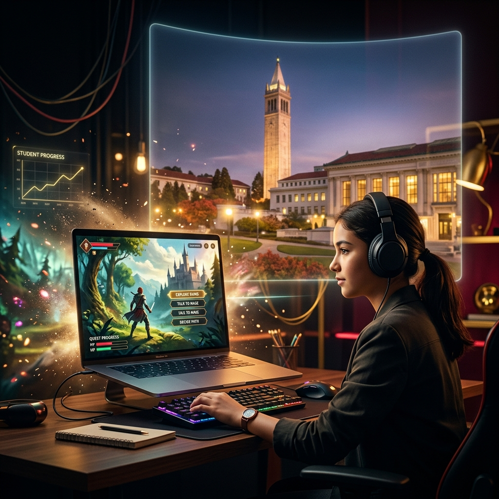
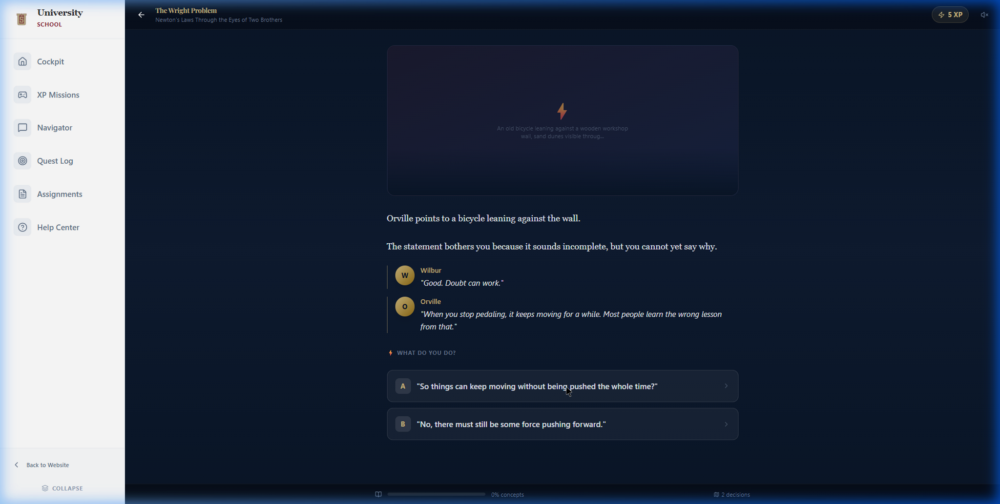
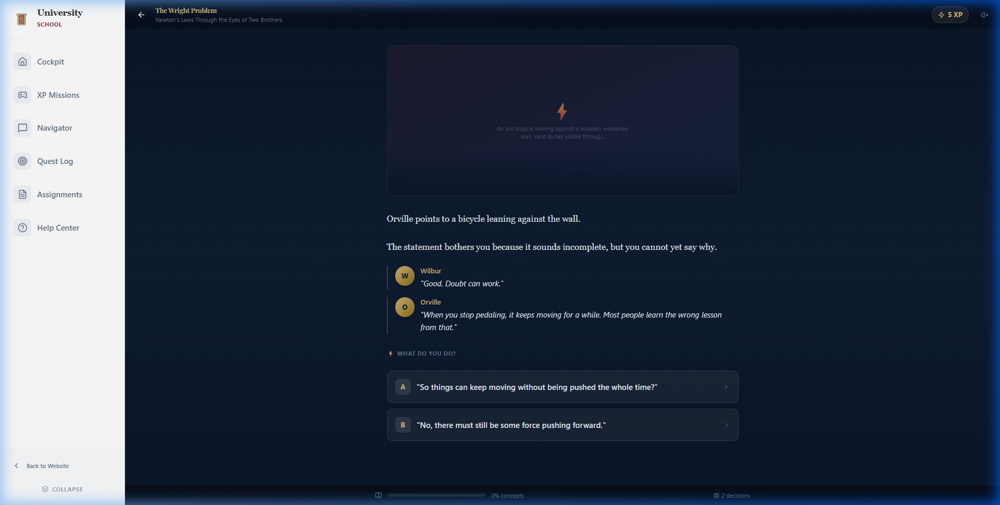
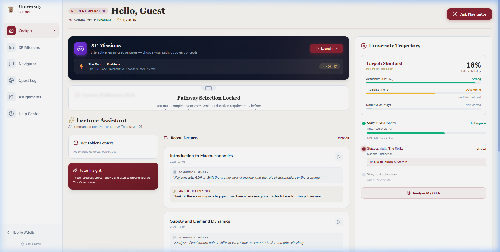
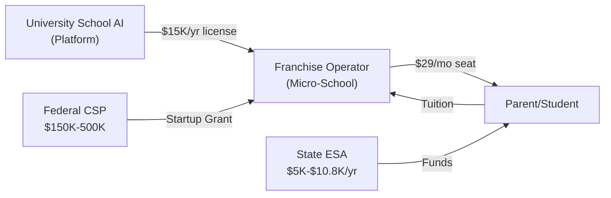
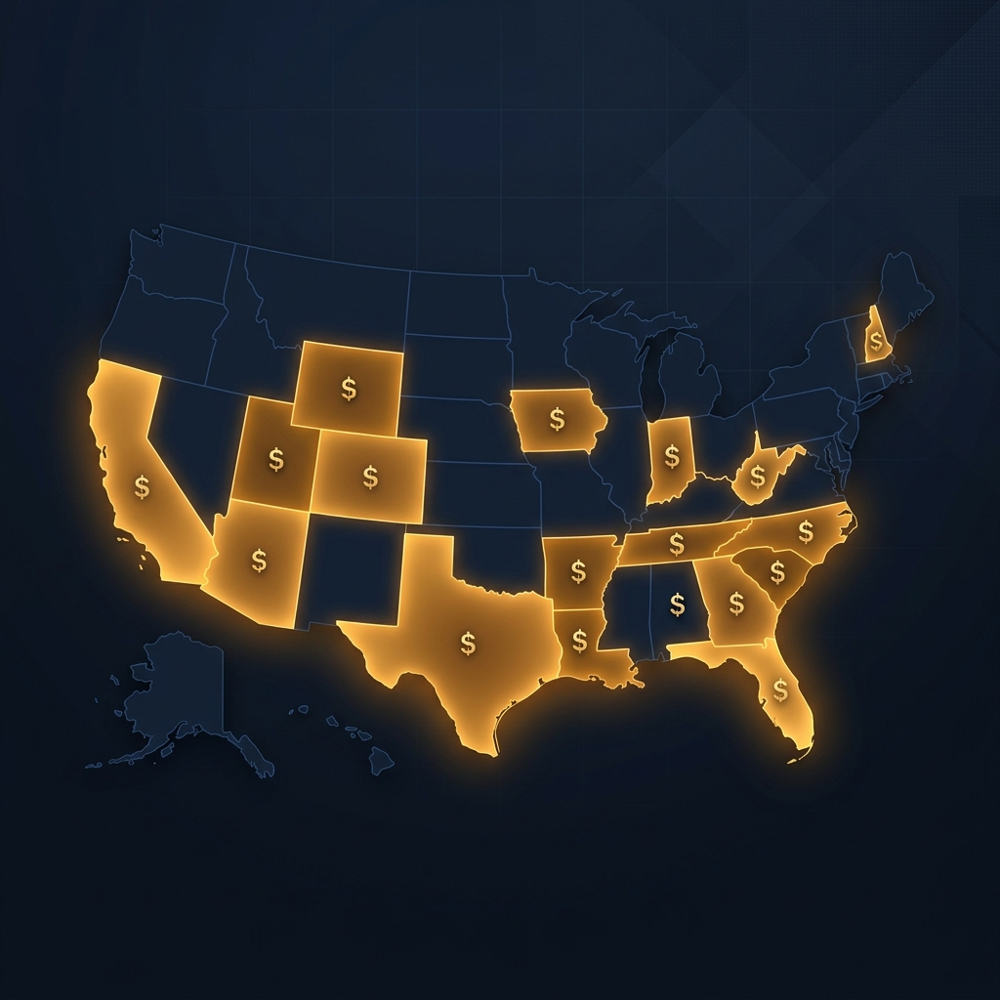
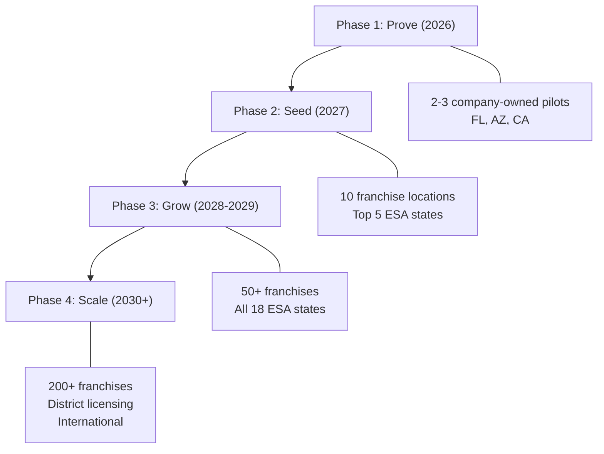
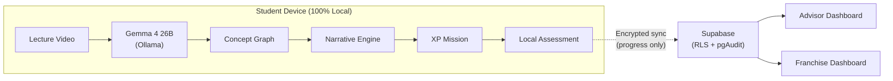

# University School AI

---



# Start college at 14.

### AI transforms university lectures into RPG adventures.
### Students play through real coursework. The government pays.

---

**University School AI Inc.** | Seed Round | April 2026
mike@universityschool.ai · 415-272-8543
Techstars '26 · UC Berkeley Affiliation

---
---

# The Problem

## $1.3 trillion in student debt. 40% of college students drop out. And it starts with how we teach.

Traditional education hasn't changed in 200 years: a teacher talks, students sit, and 68% zone out by minute 15. Remote learning made it worse — online course completion rates are **below 50%** for most demographics.

Meanwhile:
- **49% of teens** say school is "boring" or "irrelevant" (Gallup, 2024)
- **AP/IB pass rates** have stagnated despite $90B/year in ed spending
- **6M students** are chronically absent from US schools post-COVID
- Parents are leaving the system: **homeschooling grew 51%** since 2020

The $680B global education market is desperate for something that works. Not another LMS. Not another worksheet app. Something students actually *want* to do.

---
---

# The Solution

## University School AI turns real university courses into playable RPG adventures.

Students don't watch lectures. They **play** through them.

Our **XP Engine** takes actual university course materials — lecture videos, syllabi, textbooks from ASU Online, Berkeley, Coursera — and transforms them into **branching-choice narrative missions**. Think *Choose Your Own Adventure* meets college physics.

**How it works:**
1. **AI Ingests the Course** — Gemma 4 (26B parameter multimodal AI) watches the lecture video, reads the slides, and builds a concept graph in a single pass
2. **Narratives Are Generated** — Each concept becomes a story scene with choices. Wrong answers aren't dead ends — they're Productive Failure scenes that *improve* retention by 20-40%
3. **Students Play & Learn** — XP, branching paths, AI-generated illustrations, real assessment underneath
4. **Advisors See Everything** — Concept mastery heatmaps, misconception tracking, intervention alerts

> **The result: students start college-level coursework at 14, earn dual-enrollment credit, and actually remember what they learned.**

---
---

# The Product

````carousel

<!-- slide -->

<!-- slide -->

<!-- slide -->

````

### Three layers. One breakthrough.

| Layer | What It Does | Status |
|-------|-------------|--------|
| **Multimodal AI Ingestion** | Gemma 4 26B processes lecture video + slides + docs → concept graph | TRL-6 ✅ |
| **Branching Narrative Engine** | Transforms concepts into RPG missions with Productive Failure paths | TRL-6 ✅ |
| **Adaptive Assessment** | Per-student concept mastery tracking with advisor dashboards | TRL-6 ✅ |

**Critical differentiator: All AI runs locally on the student's device. Zero cloud. Zero data exposure. The strongest FERPA/COPPA posture in EdTech.**

---
---

# The Business Model

## Franchise micro-schools + government-funded students = recurring revenue from Day 1.



### Revenue Streams
| Stream | Amount | Who Pays |
|--------|--------|----------|
| **Franchise License** | $15,000/year per location | Franchise Operator |
| **Student Seat** | $29/month ($348/year) | Parent (via ESA funds) |
| **Enterprise Licensing** | Custom | School Districts |
| **Content Pipeline API** | TBD | Higher Ed Partners |

### The ESA Unlock

**18 states now deposit $5,000 – $10,800 per year directly into parents' education accounts.** Parents choose where to spend it. Every University School AI micro-school is an eligible provider.

This means **parents arrive with funding already in hand.** The franchise operator doesn't have to sell — they have to *enroll.*

---
---

# The Market

## $680B global → $42B US K-12 EdTech → $2.1B addressable today.

| Market Layer | Size | Description |
|-------------|------|-------------|
| **TAM** | **$680B** | Global education market |
| **SAM** | **$42B** | US K-12 EdTech + supplemental education |
| **SOM** | **$2.1B** | Alternative education (micro-schools, learning pods, homeschool services) |

### Why now?

1. **Universal ESAs are exploding.** 13 states passed universal school choice in the last 3 years. Texas ($10.8K/student) launches in 2026. The addressable market doubles every 18 months as new states pass ESA legislation.

2. **Local AI is finally possible.** Gemma 4 runs a 26B parameter multimodal model on a consumer laptop. Two years ago this required a data center. We're the first to build an entire EdTech platform on local-only AI.

3. **Parents are leaving traditional school.** Homeschooling grew 51% since 2020. 3.3M students are now homeschooled. Micro-schools grew 500%+. These families are our customers.

4. **GenAI in EdTech is a $20B category forming now.** But every competitor (Khanmigo, Synthesis) sends student data to the cloud. We don't.

---
---

# 18 States Will Pay Your Students' Tuition



| State | $/Student/Year | Program | Universal? |
|-------|:--------------:|---------|:----------:|
| **Texas** | **$10,800** | Education Savings Account | ✅ 2026 |
| **Florida** | **$8,000** | Personalized Education Program | ✅ |
| **Utah** | **$8,000** | Utah Fits All | ✅ |
| **Arizona** | **$7,500** | Empowerment Scholarship | ✅ |
| **Iowa** | **$7,800** | Students First ESA | ✅ |
| **Tennessee** | **$7,000** | Education Freedom Act | ✅ |
| **Alabama** | **$7,000** | CHOOSE Act | ✅ |
| **Arkansas** | **$6,800** | Education Freedom Accounts | ✅ |
| **South Carolina** | **$6,800** | ESA Program | ✅ |
| **Indiana** | **$6,500** | Choice Scholarships | Broad |
| **Louisiana** | **$5,200–$15,200** | LA GATOR | ✅ |
| **New Hampshire** | **$5,200** | Education Freedom Accounts | ✅ |
| **West Virginia** | **$4,750** | Hope Scholarship | ✅ |
| **North Carolina** | **$3,200–$7,400** | Opportunity Scholarship | ✅ |
| + 4 more | Varies | Various programs | Partial |

> **This is the largest transfer of public education dollars in American history.** Every new ESA state expands our addressable market by millions of families.

---
---

# Competitive Moat

## Five unfair advantages. No competitor has more than one.

| Advantage | Us | Khanmigo | Alpha School | Synthesis | Prenda |
|-----------|:--:|:--------:|:------------:|:---------:|:------:|
| **Local-first AI (no cloud data)** | ✅ | ❌ OpenAI cloud | ❌ | ❌ | ❌ |
| **University research partnership** | ✅ Berkeley | ❌ | ❌ | ❌ | ❌ |
| **Productive Failure pedagogy** | ✅ Kapur research | ❌ | ❌ | ❌ | ❌ |
| **Auto-generates from any lecture** | ✅ Gemma 4 | ❌ Static | ❌ Static | ❌ Static | ❌ Static |
| **Franchise model + ESA integration** | ✅ | ❌ | Partial | ❌ | Partial |
| **AI grant discovery & auto-drafting** | ✅ A-DIGER | ❌ | ❌ | ❌ | ❌ |

### Why can't incumbents copy this?

- **Khanmigo** is locked into OpenAI's API. They *can't* go local — their business model depends on cloud inference. Student data flows through OpenAI's servers.
- **Alpha School** has a fixed curriculum. They don't generate content from any arbitrary university lecture. Scaling to new subjects requires manual content creation.
- **No one else has Berkeley.** Our PI (Dr. David Whitney, Vision Science) and institutional affiliation provide research credibility that takes years to build.

---
---

# Traction & Milestones

| Date | Milestone |
|------|-----------|
| **Q4 2025** | XP Engine prototype — Wright Brothers Physics (PHY-121) with 40+ narrative nodes |
| **Q1 2026** | Gemma 4 multimodal ingestion pipeline — video + slides → concept graph in single pass |
| **Q1 2026** | Franchise Owner Dashboard — real-time student analytics + revenue tracking |
| **Q1 2026** | Techstars '26 acceptance |
| **Q2 2026** | A-DIGER grant engine — auto-discovers and drafts proposals for 556+ federal/state opportunities |
| **Q2 2026** | 8-state scraper live (CA, FL, TX, NC, GA, AZ, IN, CO) + 4 federal sources |
| **Q2 2026** | Company data room + grant compliance pipeline (IES SBIR, NSF STTR ready) |
| **Q3 2026** | First charter applications filed (FL, AZ) |
| **Q4 2026** | First franchise locations open |

### Key Validation
- **~85% concept extraction accuracy** against human-tagged syllabi (Bloom's taxonomy)
- **10 AI-generated scenes per mission** demonstrated
- **Productive Failure literature:** 20-40% retention improvement (Kapur, 2008-2016 — published, peer-reviewed)
- **556 federal/state grant opportunities** identified by A-DIGER engine in first sweep

---
---

# Go-to-Market

## Franchise-led expansion in ESA states. Government grants fund each new location.



### Phase 1: Prove (Now – Q4 2026)
- Open 2-3 company-owned pilot locations in FL, AZ, CA
- File IES SBIR Phase I and NSF STTR Phase I proposals (Dr. Whitney as Berkeley PI)
- Validate learning outcomes with controlled study

### Phase 2: Seed (2027)
- Launch franchise program in top 5 ESA states (TX, FL, AZ, UT, IA)
- Target: 10 franchise locations, 150 students
- CSP grants fund each franchise startup ($150-500K per location — franchisee applies, we draft)

### Phase 3: Grow (2028-2029)
- Expand to all 18 ESA states
- 50+ franchise locations, 750+ students
- Enterprise district licensing pilot
- Publish efficacy study with Berkeley

### Phase 4: Scale (2030+)
- 200+ franchise locations
- International expansion (UK, Australia, UAE have similar school choice movements)
- Content marketplace: third-party educators create missions

---
---

# Technology

## Local-first AI. No cloud. No compromise.



### Why local matters for investors

1. **Regulatory moat.** FERPA/COPPA compliance is existential in K-12. Cloud AI companies face increasing regulatory pressure. We're immune — student data never leaves the device.

2. **Zero marginal inference cost.** Cloud AI companies pay per-token. We pay nothing per inference. As we scale, our AI cost stays flat while theirs scales linearly.

3. **Works everywhere.** Rural areas, low-bandwidth, developing countries — if you have a laptop, you have University School AI. No internet required for core learning.

4. **Google partnership leverage.** Gemma 4 is Google's open-weight model. We're building the flagship education use case for their local AI strategy. This is a strategic relationship, not just a tech dependency.

---
---

# Team

| | |
|---|---|
| **Michael Jacobs** | **CEO & Co-Founder** |
| | Serial entrepreneur — 5x venture-backed startup cofounder |
| | Creator & Director, UC Berkeley Cognitive Science Entrepreneurship Program |
| | Designed the XP Engine architecture, Productive Failure branching narrative engine, and Gemma 4 local AI pipeline |
| | Techstars 2026 |
| | |
| **Dr. David Whitney** | **UC Berkeley PI / Scientific Advisor** |
| | Professor, UC Berkeley Department of Psychology / Vision Science |
| | Director, Perception & Cognition Lab |
| | World-class researcher in visual perception, cognitive processing, and human attention |
| | Provides the cognitive science research foundation for adaptive learning design |

### Advisors & Network
- **Techstars 2026** — Access to 10,000+ mentors, $2.3B in alumni market cap
- **UC Berkeley** — Graduate School of Education, BIDS, CITRIS institutional access
- **A-DIGER Engine** — Automated grant discovery and proposal drafting (556+ opportunities identified)

---
---

# Unit Economics

### Per Franchise Location (Steady State — Year 2+)

| Metric | Amount |
|--------|-------:|
| Students per location | 15 |
| Avg ESA per-pupil revenue | $7,500/yr |
| Tuition captured per student | $5,500/yr |
| **Annual revenue per location** | **$82,500** |
| Facility + staff + ops | ($68,000) |
| **Franchise gross profit** | **$14,500** |
| **University School AI take (license)** | **$15,000** |

### Corporate Revenue Model

| Year | Franchise Locations | Students | License Revenue | Seat Revenue | **Total ARR** |
|------|:-------------------:|:--------:|:---------------:|:------------:|:-------------:|
| **2026** | 3 (company-owned) | 35 | — | $12K | **$12K** |
| **2027** | 13 | 180 | $150K | $63K | **$213K** |
| **2028** | 40 | 550 | $450K | $192K | **$642K** |
| **2029** | 100 | 1,400 | $1.2M | $490K | **$1.7M** |
| **2030** | 250 | 3,500 | $3.0M | $1.2M | **$4.2M** |
| **2032** | 1,000 | 14,000 | $12M | $4.9M | **$16.9M** |
| **2035** | 3,000 | 42,000 | $30M | $12M | **$42M** |

*Excludes enterprise district licensing revenue (potential uplift: 2-5x at scale)*

### Key Metrics
- **CAC per franchise:** ~$5,000 (marketing + onboarding) — CSP grants cover operator startup
- **Franchise payback period:** 12-18 months
- **Net Revenue Retention:** >100% (locations add students over time)
- **Churn risk:** Low — operators are incentivized by ESA recurring revenue

---
---

# The Ask

## $2.5M Seed Round

| Use of Funds | Amount | % |
|-------------|-------:|:---:|
| **Product Engineering** (XP Engine, content pipeline, franchise dashboard) | $900K | 36% |
| **First 3 Pilot Schools** (company-owned, FL/AZ/CA) | $600K | 24% |
| **Team** (CTO hire, 2 engineers, 1 education specialist) | $500K | 20% |
| **Grant Applications** (IES SBIR, NSF STTR filing + compliance) | $200K | 8% |
| **Franchise Development** (legal, ops manual, sales) | $200K | 8% |
| **Working Capital** | $100K | 4% |
| **Total** | **$2.5M** | 100% |

### What $2.5M Buys You

- **3 operating pilot schools** with 35+ students generating data
- **IES SBIR Phase I + NSF STTR Phase I filed** (Dr. Whitney as PI) — potential $525K in non-dilutive capital
- **Franchise program launched** with first 10 operators in pipeline
- **Published efficacy study** with UC Berkeley
- **18 months of runway** to Series A metrics

### Return Catalysts
1. **Each new ESA state** expands our market by millions of families (TX alone adds 5.4M students in 2026)
2. **Non-dilutive grants** (IES SBIR Phase II = $1M, NSF STTR Phase II = $1M) extend runway without dilution
3. **Franchise model = capital-efficient scaling** — operators fund their own locations via CSP grants
4. **Enterprise district licensing** is the 10x revenue lever — one district deal replaces 30 franchises

---
---

# Why This, Why Now, Why Us

**The school choice movement is the biggest shift in American education since the GI Bill.** 18 states have created $10B+ in portable education funding that follows the student. For the first time, parents — not bureaucracies — decide where education dollars go.

**We are the only platform that:**
- ✅ Transforms *any* university lecture into a playable learning experience
- ✅ Runs entirely on local AI — zero student data exposure
- ✅ Has a UC Berkeley research partnership with a named PI
- ✅ Distributes through franchises funded by government grants
- ✅ Auto-discovers and draft grant proposals using AI

**The question isn't whether AI will transform education. It's whether students will start college at 14 — or still be sitting in rows at 18, bored, waiting for the bell.**

We're building the answer.

---

**University School AI Inc.**
mike@universityschool.ai · 415-272-8543
Techstars '26 · UC Berkeley · FERPA/COPPA Compliant

*Start college at 14.*
